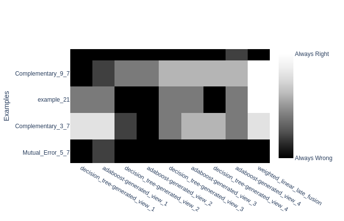

====================================================
Example 3 : Understanding the statistical iterations
====================================================

Context
-------

In the previous example, we have seen that in order to output meaningful results, the platform splits the input dataset in a training set and a testing set.
However, even if the split is done at random, one can draw a lucky (or unlucky) split and have great (or poor) performance on this specific split.
To settle this issue, the platform can run on multiple splits and return the mean.

How to use it
-------------

This feature is controlled by a single argument : ``stats_iter:`` in the config file.
Modifying this argument and setting more than one ``stats_iter`` will slightly modify the result directory's structure.
Indeed, as the platform will perform a benchmark on multiple train/test split, the result directory will be larger in order to keep all the individual results.

To run |platf| on several train/test splits, run :

.. code-block:: python

   >>> from multiview_platform.execute import execute
   >>> execute("example 3")

While |platf| computes, let us explore the new pseudo-code ::

    for each statistical iteration :
        ┌
        |for each monoview classifier:
        |    for each view:
        |        for each draw:
        |            for each fold:
        |                learn the classifier on all-1 folds and test it on 1
        |            get the mean performance
        |        get the best hyper-parameter set
        |        learn on the whole training set
        |and
        |for each multiview classifier:
        |    for each draw:
        |        for each fold:
        |            learn the classifier on all-1 folds and test it on 1
        |        get the mean performance
        |    get the best hyper-parameter set
        |    learn on the whole training set
        └

The result directory will be structured as :

.. code-block:: bash

    | started_1560_12_25-15_42
    | ├── iter_1
    | | ├── decision_tree
    | | | ├── generated_view_1
    | | | |   ├── *-summary.txt
    | | | |   ├── <other classifier dependant files>
    | | | ├── generated_view_2
    | | | |   ├── *-summary.txt
    | | | |   ├── <other classifier dependant files>
    | | ├── [..
    | | ├── ..]
    | | ├── weighted_linear_late_fusion
    | | |   ├── 

    | | ├── [..
    | | ├── ..]
    | | ├── *-accuracy_score*.png
    | | ├── *-accuracy_score*.html
    | | ├── *-accuracy_score*-class.html
    | | ├── *-accuracy_score*.csv
    | | ├── *-f1_score.png
    | | ├── *-f1_score.html
    | | ├── *-f1_score-class.html
    | | ├── *-f1_score.csv
    | | ├── *-error_analysis_2D.png
    | | ├── *-error_analysis_2D.html
    | | ├── *-error_analysis_bar.png
    | | ├── *-error_analysis_bar.html
    | | ├── feature_importances
    | | | ├── [..
    | | | ├── ..]
    | | ├── train_labels.csv
    | | └── train_indices.csv
    | ├── iter_2
    | | ├── [...
    | | ├── ...
    | | ├── ...]
    | ├── *-accuracy_score*.png
    | ├── *-accuracy_score*.html
    | ├── *-accuracy_score*-class.html
    | ├── *-accuracy_score*.csv
    | ├── *-f1_score.png
    | ├── *-f1_score.html
    | ├── *-f1_score-class.html
    | ├── *-f1_score.csv
    | ├── *-error_analysis_2D.png
    | ├── *-error_analysis_2D.html
    | ├── *-error_analysis_bar.png
    | ├── *-error_analysis_bar.html
    | ├── feature_importances
    | | ├── [..
    | | ├── ..]
    | ├── *-bar_plot_data.csv
    | ├── *-2D_plot_data.csv
    | ├── config_file.yml
    | ├── 1560_12_25-15_42-*-LOG.log
    | └── random_state.pickle

If you look closely, nearly all the files from :base_doc:`Example 1 <tutorials/example1.html>` are in each ``iter_`` directories, and some files have appeared, in which the main figures are saved.
Indeed, the files stored in ``started_1560_12_25-15_42/`` are the ones that show the mean results on all the statistical iterations.
For example, ``started_1560_12_25-15_42/*-accuracy_score.html`` looks like :

.. raw:: html
    .. :file: ./images/example_3/mean_acc.html
    :file: ./image/fake.html

Similarly for the f1-score :

.. raw:: html
    .. :file: ./images/example_3/f1.html
    :file: ./image/fake.html

The main difference between this plot an the one from :base_doc:`Example 1 <tutorials/example1.html>` is that here, the scores are means over all the statistical iterations, and the standard deviations are plotted as vertical lines on top of the bars and printed after each score under the bars as "± <std>".

This has also an impact on the error analysis of :base_doc:`Example 1 <tutorials/example1.html>`. Indeed, now it has multiple shades of gray depending on the number of iterations that succeeded or failed on the example :

.. raw:: html
    .. :file: ./images/example_3/err.html
    :file: ./image/fake.html

Indeed, if we zoom in, we can distinguish them better :

Duration
<<<<<<<<

Increasing the number of statistical iterations can be costly in terms of computational resources, indeed it is nearly a straight multiplication of the computation time .

.. note::

    Parallelizing |platf|'s statistical iteration can improve its efficiency when using multiple iterations, it is currently work in progress

